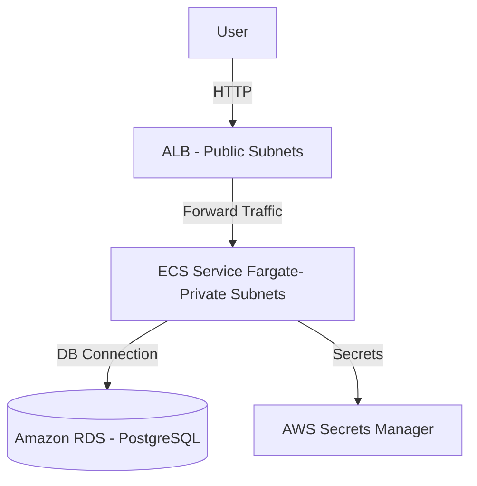
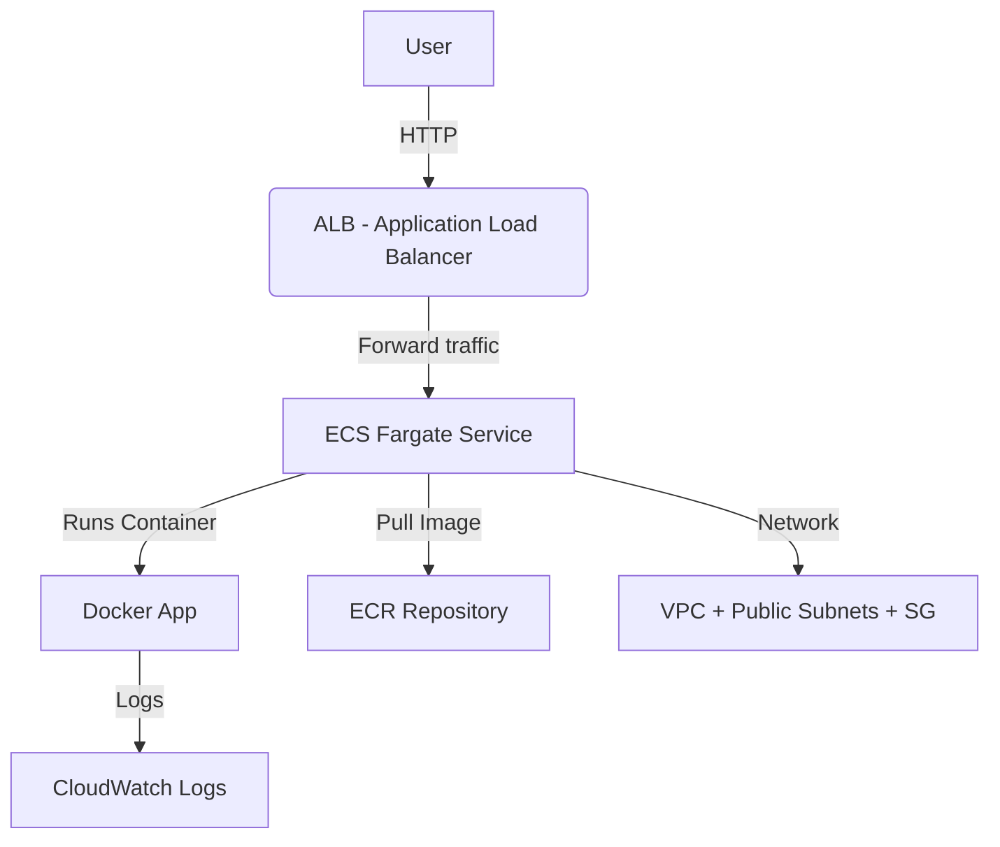
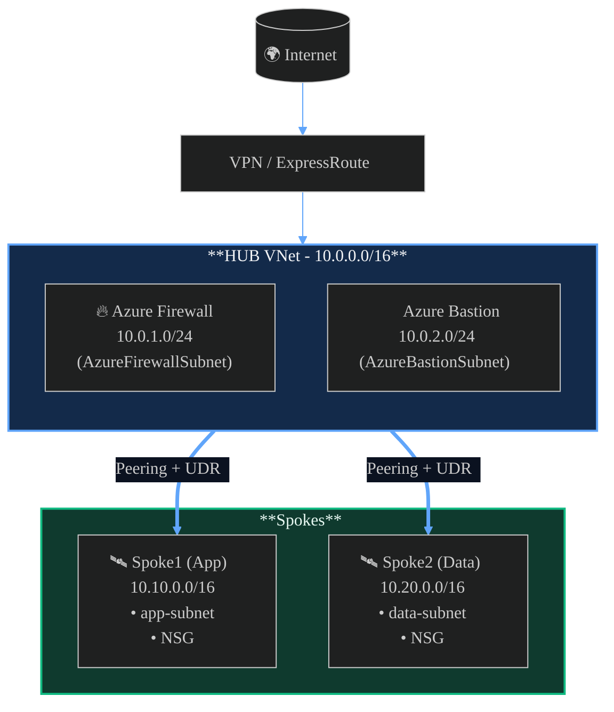

# ☁️ Cloud & DevOps Portfolio – Mouhamadou LY

Welcome to my **Cloud & DevOps Projects Portfolio** 👋  
This repository showcases my hands-on projects across **AWS** and **Microsoft Azure**,  
with a focus on **Infrastructure as Code (Terraform)**, **container orchestration**, and **automation**.

---

## 🧠 About Me

I’m an HPC and Cloud Engineer passionate about automation, scalability, and infrastructure design.  
I build production-grade architectures on **AWS** and **Azure** using **Terraform**, **Docker**, and **CI/CD pipelines**.

- 🌍 Multi-Cloud: AWS & Azure & Google 
- ⚙️ IaC: Terraform  
- 🐳 Containers: Docker, ECS, AKS, GKE, EKS  
- 🔒 Security: IAM, Secrets Manager, Key Vault  
- 📊 Monitoring: CloudWatch, Azure Monitor  

---

## 🚀 Projects Overview

### 🟧 AWS Projects

| # | Project | Description | Key Technologies |
|---|----------|--------------|------------------|
| 1️⃣ | [Serverless API](https://github.com/lamine93/aws-lambda-serverless) | REST API using Lambda, API Gateway & DynamoDB | AWS Lambda, API Gateway, DynamoDB, Cognito, Terraform |
| 2️⃣ | [Three-Tier Web App](https://github.com/lamine93/aws-three-thier-app) | Flask API on ECS Fargate + RDS + ALB | ECS, RDS, ALB, Secrets Manager |
| 3️⃣ | [Monitoring & Scaling](./aws/04-monitoring) | ECS Auto Scaling with CloudWatch | CloudWatch, ECS, Terraform |
| 5️⃣ | [CI/CD Pipeline](https://github.com/lamine93/aws-ecs-fargate) | GitHub Actions deploying Docker images to ECS | GitHub Actions, ECR, Terraform |

---

### 🟦 Azure Projects

| # | Project | Description | Key Technologies |
|---|----------|--------------|------------------|
| 1️⃣ | [Hub Spoke](https://github.com/lamine93/vnet-demo) | Scalable web app with Azure VM Scale Sets | Vnet, Security Group, IAM, Terraform |
| 2️⃣ | [Container Apps](https://github.com/lamine93/container-app) | Deploying Flask API using Azure Container Apps | ACA, ACR, Terraform |
| 3️⃣ | [AKS with Terraform](https://github.com/lamine93/aks-demo) | Kubernetes cluster managed via Terraform | AKS, Terraform, ACR |
| 4️⃣ | [Azure Functions API](https://github.com/lamine93/azure-app-function-v2) | Serverless API with Cosmos DB backend | Azure Functions, Cosmos DB |

---

## 🧰 Tech Stack Summary

| Category | AWS | Azure |
|-----------|-----|--------|
| **Compute** | ECS Fargate, Lambda | VMSS, Container Apps, AKS |
| **Database** | RDS, DynamoDB | Cosmos DB |
| **IaC** | Terraform | Terraform |
| **Secrets** | Secrets Manager | Key Vault |
| **Networking** | VPC, ALB | VNet, Load Balancer |
| **Monitoring** | CloudWatch | Azure Monitor |

---

## 📊 Architecture Examples

 **🏗️ Three-Tier Web Application on AWS**

**🚀 AWS ECS Fargate + ALB Deployment (Terraform)**

**Azure Hub Spoke topology**

