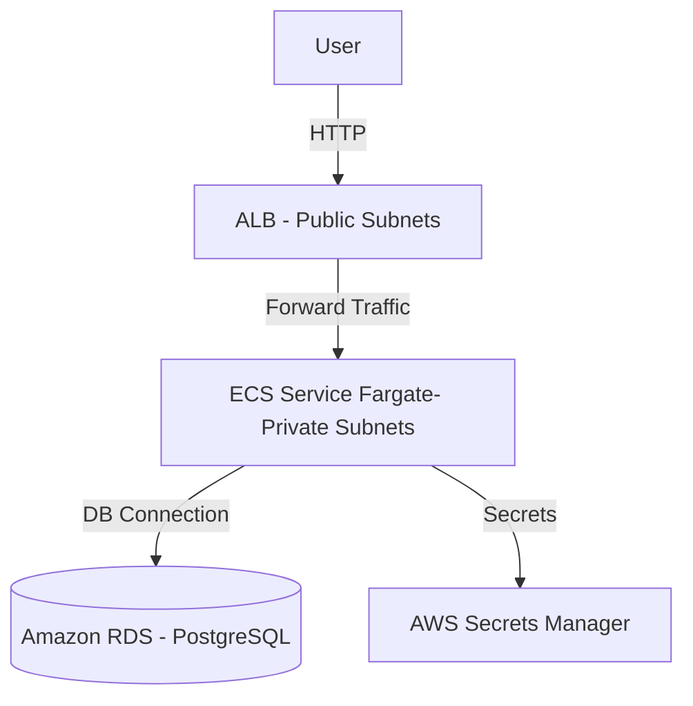
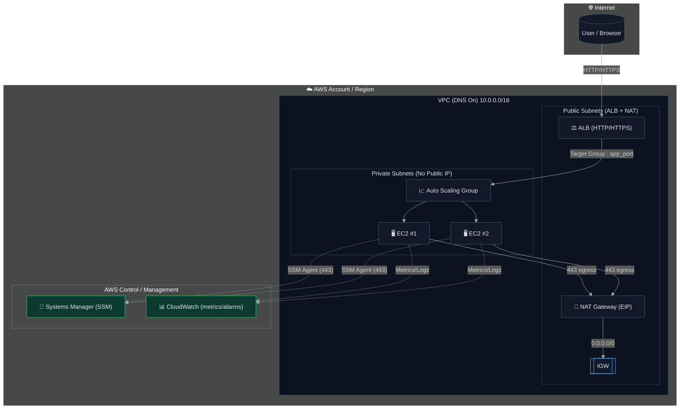
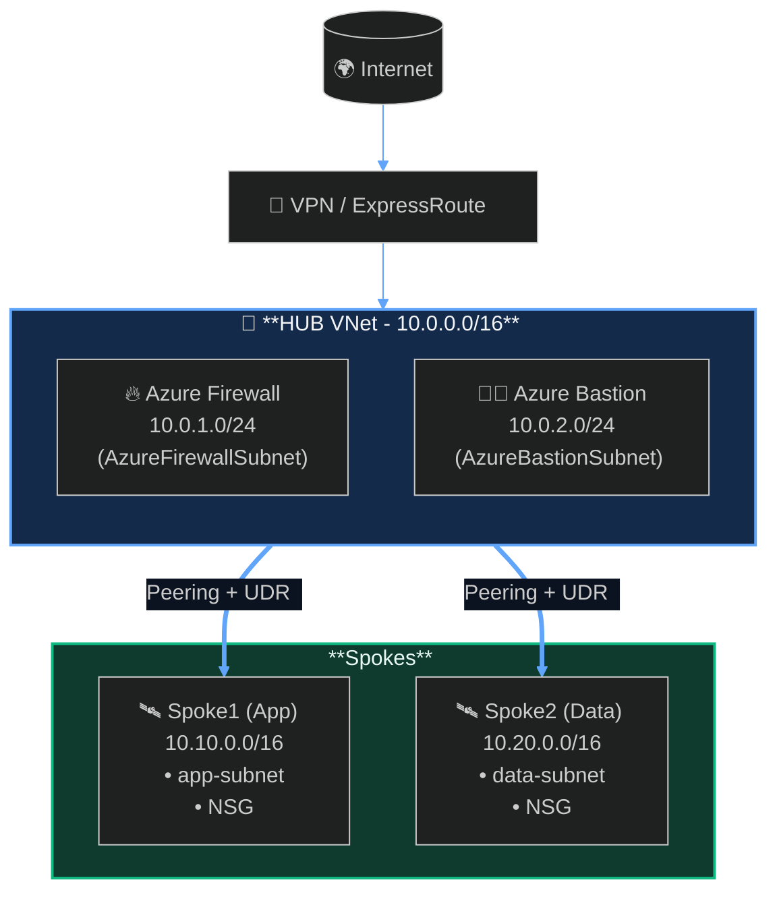
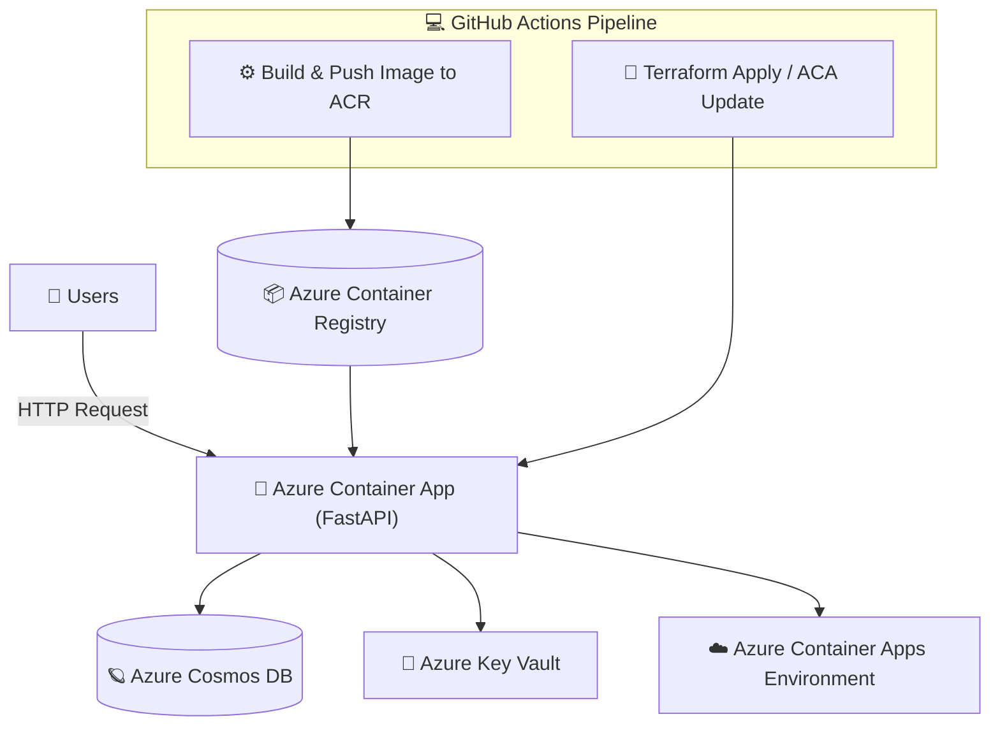

# ☁️ Cloud & DevOps Portfolio – Mouhamadou LY

Welcome to my **Cloud & DevOps Projects Portfolio** 👋  
This repository showcases my hands-on projects across **AWS** and **Microsoft Azure**,  
with a focus on **Infrastructure as Code (Terraform)**, **container orchestration**, and **automation**.

---

## 🧠 About Me

I’m an HPC and Cloud Engineer passionate about automation, scalability, and infrastructure design.  
I build production-grade architectures on **AWS**, **Azure** and **Google** using **Terraform**, **Docker**,**K8s** and **CI/CD pipelines**.

- 🌍 Multi-Cloud: AWS & Azure & Google 
- ⚙️ IaC: Terraform  
- 🐳 Containers: Docker, ECS, AKS, GKE, EKS  
- 🔒 Security: IAM, Secrets Manager, Azure Key Vault, RBAC  
- 📊 Monitoring: CloudWatch, Azure Monitor
- CI/CD: Github Action  

---

## 🚀 Projects Overview

### 🟧 AWS Projects

| # | Project | Description | Key Technologies |
|---|----------|--------------|------------------|
| 1️⃣ | [Serverless API](https://github.com/lamine93/aws-lambda-serverless) | REST API using Lambda, API Gateway & DynamoDB | AWS Lambda, API Gateway, DynamoDB, Cognito, Terraform |
| 2️⃣ | [Three-Tier Web App](https://github.com/lamine93/aws-three-thier-app) | Flask API on ECS Fargate + RDS + ALB | ECS, RDS, ALB, Secrets Manager |
| 3️⃣ | [Monitoring & Scaling](https://github.com/lamine93/aws-autoscaling-monotoring) | ECS Auto Scaling with CloudWatch | ELB, CloudWatch, EC2, SSM, SSN, Terraform |
| 5️⃣ | [CI/CD Pipeline](https://github.com/lamine93/aws-ecs-fargate) | GitHub Actions deploying Docker images to ECS | GitHub Actions, ECR, Terraform |

---

### 🟦 Azure Projects

| # | Project | Description | Key Technologies |
|---|----------|--------------|------------------|
| 1️⃣ | [Hub Spoke](https://github.com/lamine93/vnet-demo) | Scalable network topology | Vnet, Security Group, IAM, Terraform |
| 2️⃣ | [Container Apps](https://github.com/lamine93/cosmos-app) | Deploying Flask API using Azure Container Apps | ACA, ACR, Cosmos DB, Key Vault, Terraform |
| 3️⃣ | [AKS with Terraform](https://github.com/lamine93/gitops-aks) | Kubernetes cluster managed via ArgoCD | AKS, Terraform, ACR |
| 4️⃣ | [Azure Functions API](https://github.com/lamine93/azure-app-function-v2) | Serverless API with Cosmos DB backend | Azure Functions, Cosmos DB |

### 🟩 GCP Projects

| # | Project | Description | Key Technologies |
|---|----------|--------------|------------------|
| 1️⃣ | [GKE](https://github.com/lamine93/gke-lab) | Flask GKE Application | GKE, Artifact Registry, Docker, Terraform |

---

## 🧰 Tech Stack Summary

| Category | AWS | Azure |
|-----------|-----|--------|
| **Compute** | ECS Fargate, Lambda, EC2, ASB, SSM | VMSS, Container Apps, AKS |
| **Database** | RDS, DynamoDB | Cosmos DB |
| **IaC** | Terraform | Terraform |
| **Secrets** | Secrets Manager | Key Vault |
| **Networking** | VPC, ALB | VNet, Load Balancer |
| **Monitoring** | CloudWatch | Azure Monitor |

---

## 📊 Architecture Examples

 **🏗️ Three-Tier Web Application on AWS**

```mermaid
graph TD
    A[User] -->|HTTP| B[ALB - Public Subnets]
    B -->|Forward Traffic| C[ECS Service Fargate- Private Subnets]
    C -->|DB Connection| D[(Amazon RDS - PostgreSQL)]
    C -->|Secrets| E[AWS Secrets Manager]
```

**🚀 AWS autoscaling & monotoring**

```mermaid

%%{init: {
  "theme": "dark",
  "themeVariables": {
    "primaryColor": "#1f2937",
    "primaryTextColor": "#e5e7eb",
    "primaryBorderColor": "#4b5563",
    "lineColor": "#9ca3af",
    "secondaryColor": "#0f172a",
    "tertiaryColor": "#111827",
    "fontSize": "14px"
  }
}}%%
flowchart TB
  %% Groups
  subgraph Internet["🌐 Internet"]
    Client[(User / Browser)]
  end

  subgraph AWS["☁️ AWS Account / Region"]
    direction TB

    subgraph VPC["VPC (DNS On) 10.0.0.0/16"]
      direction TB

      %% Public tier
      subgraph Public["Public Subnets (ALB + NAT)"]
        direction TB
        IGW[[IGW]]
        ALB["⚖️ ALB (HTTP/HTTPS)"]
        NAT["🔁 NAT Gateway (EIP)"]
      end

      %% Private tier
      subgraph Private["Private Subnets (No Public IP)"]
        direction TB
        ASG["📈 Auto Scaling Group"]
        EC2A["🖥️ EC2 #1"]
        EC2B["🖥️ EC2 #2"]
      end
    end

    %% Control plane services (no direct path drawing to avoid clutter)
    subgraph Control["AWS Control / Management"]
      direction TB
      SSM["🔐 Systems Manager (SSM)"]
      CW["📊 CloudWatch (metrics/alarms)"]
    end
  end

  %% Traffic flow
  Client -->|HTTP/HTTPS| ALB
  ALB -->|Target Group : app_port| ASG
  ASG --> EC2A
  ASG --> EC2B

  %% Outbound path from private subnets
  EC2A -->|443 egress| NAT
  EC2B -->|443 egress| NAT
  NAT -->|0.0.0.0/0| IGW

  %% Mgmt
  EC2A -. SSM Agent (443) .-> SSM
  EC2B -. SSM Agent (443) .-> SSM
  EC2A -. Metrics/Logs .-> CW
  EC2B -. Metrics/Logs .-> CW

  %% Styling
  classDef tier fill:#0b1220,stroke:#334155,color:#e5e7eb;
  classDef node fill:#111827,stroke:#475569,color:#e5e7eb;
  classDef svc  fill:#0b3b2e,stroke:#22c55e,color:#eafff4;   %% mgmt services green-ish
  classDef net  fill:#0e1a2b,stroke:#60a5fa,color:#e5f0ff;   %% network blue-ish
  classDef edge stroke:#94a3b8,color:#cbd5e1;

  class VPC,Public,Private tier;
  class ALB,NAT,ASG,EC2A,EC2B,Client node;
  class SSM,CW svc;
  class IGW net;

```

**Azure Hub Spoke topology**

```mermaid
%%{init: {
  "theme": "dark",
  "themeVariables": {
    "primaryColor": "#0b1220",
    "primaryTextColor": "#e5e7eb",
    "primaryBorderColor": "#6b7280",
    "lineColor": "#60a5fa",
    "tertiaryColor": "#0b1220",
    "fontFamily": "ui-monospace, SFMono-Regular, Menlo, Monaco, Consolas, monospace",
    "edgeLabelBackground": "#0b1220"
  }
}}%%

flowchart TB
  %% --- TOP: Internet -> VPN/ER ---
  Internet[(🌍 Internet)]
  GW["🔐 VPN / ExpressRoute &nbsp"]
  Internet --> GW

  %% --- HUB ---
  subgraph HUB["💠 **HUB VNet - 10.0.0.0/16**&nbsp"]
    direction TB
    FW["🔥 Azure Firewall<br/>10.0.1.0/24<br/>(AzureFirewallSubnet)"]
    Bastion["🧑‍💻 Azure Bastion<br/>10.0.2.0/24<br/>(AzureBastionSubnet)&nbsp"]
  end

  %% --- SPOKES GROUP ---
  subgraph SPOKES["**Spokes**&nbsp"]
    
    direction LR
    Spoke1["🛰️ Spoke1 (App) &nbsp<br/>10.10.0.0/16<br/>• app-subnet<br/>• NSG"]
    Spoke2["🛰️ Spoke2 (Data)&nbsp<br/>10.20.0.0/16<br/>• data-subnet<br/>• NSG"]
  end

  %% --- FLOWS ---
  GW --> HUB
  HUB == "Peering + UDR&nbsp&nbsp" ==> Spoke1
  HUB == "Peering + UDR&nbsp&nbsp" ==> Spoke2

  %% --- OPTIONALS BOX ---
%%   subgraph OPTIONS["Options"]
%%     direction TB
%%     NAT["↗️ NAT Gateway (egress centralisé)"]
%%     PDNS["📛 Private DNS + Private Endpoints<br/>(KV, ACR, Storage, DB)"]
%%     NOTE["🔭 Bastion pour SSH/RDP (no public IP on VMs)"]
%%   end

  %% --- STYLES ---
  classDef hub    fill:#132a4a,stroke:#60a5fa,stroke-width:2px,color:#f3f4f6;
  classDef spokes fill:#0f3a2e,stroke:#10b981,stroke-width:2px,color:#e7f8f2;
  classDef opts   fill:#1f2937,stroke:#9ca3af,stroke-width:1.5px,color:#e5e7eb;
  class HUB hub;
  class SPOKES spokes;
  class OPTIONS opts;
```

**Azure Container + Cosmos DB**

```mermaid

flowchart TB
  subgraph GitHub["💻 GitHub Actions Pipeline"]
    Build[⚙️ Build & Push Image to ACR]
    Deploy[🚀 Terraform Apply / ACA Update]
  end

  ACR[(📦 Azure Container Registry)]
  ACA_ENV["☁️ Azure Container Apps Environment"]
  ACA_APP["🐳 Azure Container App (FastAPI)"]
  KV["🔐 Azure Key Vault"]
  COSMOS[(🪐 Azure Cosmos DB)]
  USERS["👥 Users"]

  USERS -->|"HTTP Request"| ACA_APP
  ACA_APP --> COSMOS
  ACA_APP --> KV
  Build --> ACR
  ACR --> ACA_APP
  Deploy --> ACA_APP
  ACA_APP --> ACA_ENV

```
